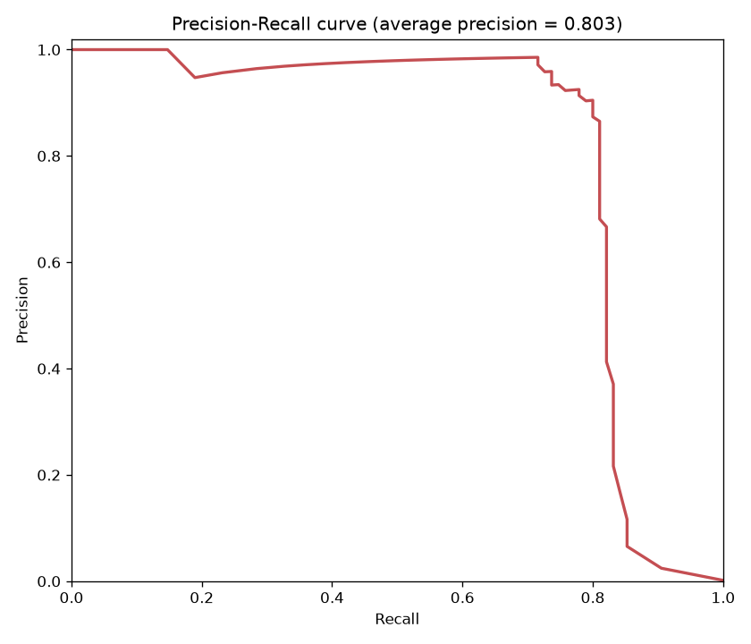

# Credit Card Fraud Detection

Binary fraud classification on a severely imbalanced dataset (0.17% fraud). Accuracy is misleading here; the real metric trade-off is precision vs. recall.



## Problem / Motivation

Fraud is rare: in this dataset, only 1 in about 600 transactions. That makes it a different kind of classification problem than a balanced one - a model can score 99.83% "accuracy" while catching zero fraud. This project covers why accuracy is the wrong metric here, several ways to correct for the imbalance, and a business-aware decision about where to set the detection threshold.

## Key Findings

- **A do-nothing model already scores 99.83% accuracy** by always predicting "legitimate" — the starting proof that accuracy alone is meaningless here.
- **Algorithm choice mattered more than imbalance-handling tricks**: forcing class weights or SMOTE onto logistic regression pushed recall to 87% but collapsed precision to ~5% (F1: 0.10). Switching to a Random Forest reached 95.8% precision *and* 72.6% recall simultaneously (F1: 0.826) - a clear improvement over the 0.10 F1 from class weights or SMOTE, from changing the model rather than the data.
- **Tuning the decision threshold beat the default 50% cutoff with zero retraining**: the F1-optimal threshold (0.255) reached precision 90.5% / recall 80.0% (F1: 0.849) — catching more real fraud than the default threshold, with only a modest precision cost.
- **F1-optimal isn't the same as business-optimal**: since missing real fraud typically costs far more than a false alarm, a real deployment would likely accept an even lower threshold than the F1-optimal one — a judgment call the data alone can't make.

## Tech Stack

- Python 3, pandas, scikit-learn (LogisticRegression, RandomForestClassifier)
- imbalanced-learn (SMOTE)
- matplotlib / seaborn
- Data: ULB/Kaggle Credit Card Fraud dataset, via a Zenodo mirror

## How it works

```
01_eda_and_imbalance.ipynb    -> understand the 0.17% fraud rate, why accuracy misleads
02_baseline_model.ipynb       -> logistic regression baseline + precision/recall/F1/ROC-AUC
03_handling_imbalance.ipynb   -> class weights vs. SMOTE, the precision/recall trade-off
04_stronger_model.ipynb       -> Random Forest: better algorithm beats imbalance tricks
05_threshold_tradeoff.ipynb   -> precision-recall curve, F1-optimal threshold, business framing
```

`data_prep.py` holds the one shared loading/splitting/scaling function every notebook uses — a stratified train/test split (so both sets keep the same ~0.17% fraud rate) with `Time`/`Amount` scaled to match the already-standardized PCA features.

## Getting Started

```bash
git clone https://github.com/Tanos3000/credit-card-fraud-detection.git
cd credit-card-fraud-detection
python3 -m venv venv
source venv/bin/activate
pip install -r requirements.txt

python download_data.py    # downloads the dataset into data/
jupyter notebook            # run notebooks 01 to 05 in order
```

## Data Source

[Credit Card Fraud Detection](https://www.kaggle.com/datasets/mlg-ulb/creditcardfraud) — 284,807 real, anonymized transactions from European cardholders, September 2013, collected by the Machine Learning Group at Université Libre de Bruxelles (ULB) with Worldline. Downloaded here from a [Zenodo mirror](https://zenodo.org/records/7395559) (CC-BY-4.0) to avoid requiring a Kaggle login.

## What I learned

The most counter-intuitive result was that fixing the imbalance directly (class weights, SMOTE) made the logistic regression model *worse* by the metric that matters (F1), even though it looked like it was "working" (recall went way up). It took checking ROC-AUC to realize the model's actual ranking ability barely changed — only the default threshold's position relative to that ranking did. That separated two questions I'd been conflating: "is the model good at distinguishing fraud from legitimate transactions" and "where do I draw the line for a yes/no decision" — they turned out to need very different fixes (a better algorithm for the first, threshold tuning for the second).
